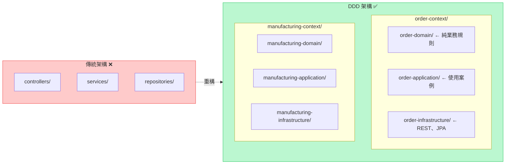
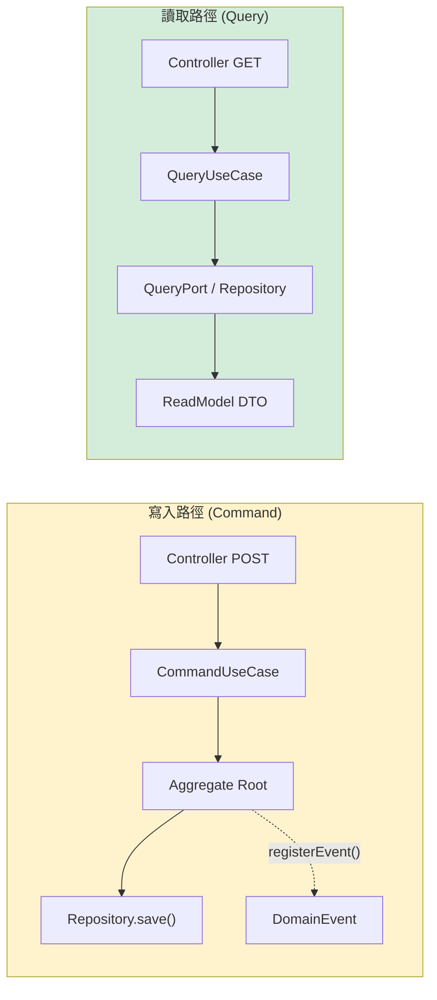
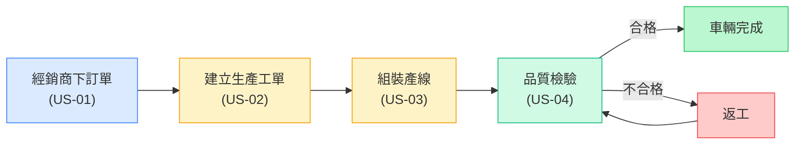
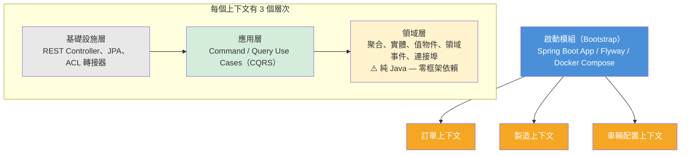
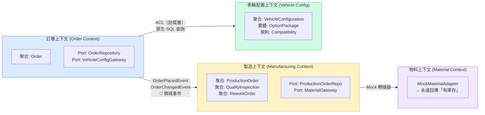
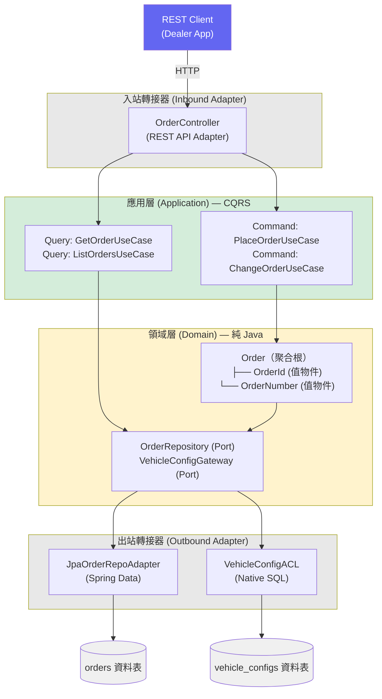
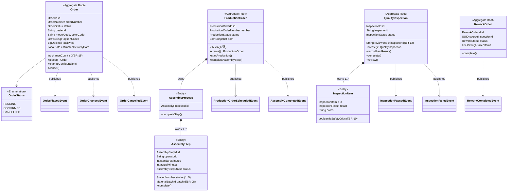
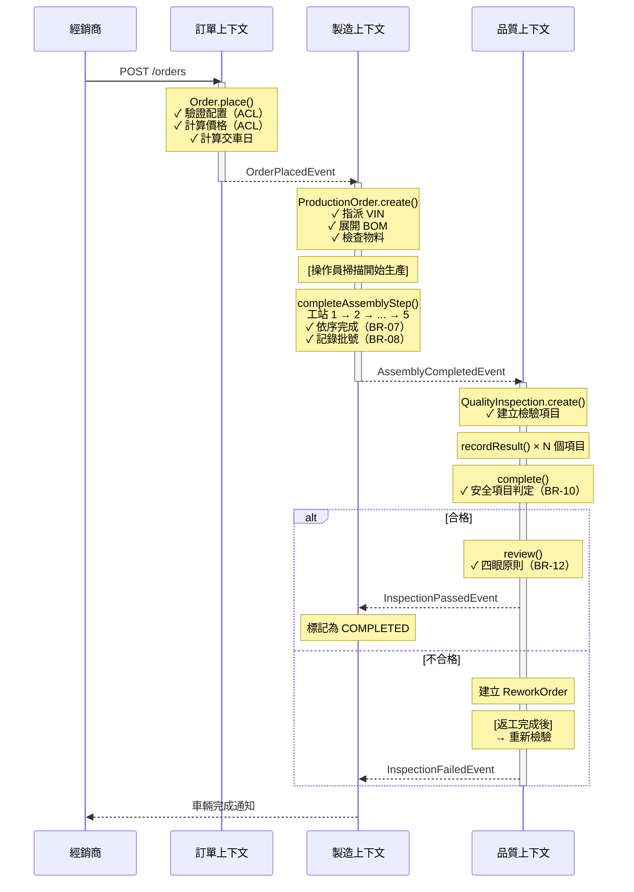
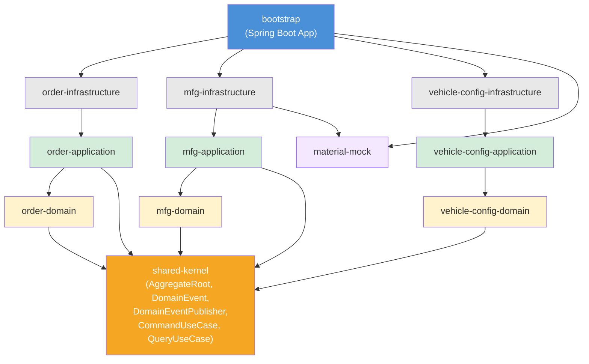

# AutoMFG — 汽車製造 DDD 概念驗證專案

一個實作導向的 **領域驅動設計（Domain-Driven Design, DDD）** 專案，模擬汽車製造從下單到交車的完整流程。使用 **Java 21**、**Spring Boot 3** 與 **六角架構（Hexagonal Architecture）** 打造，展示 DDD 如何馴服複雜的業務領域。

---

## 目錄

- [為什麼需要 DDD？](#為什麼需要-ddd)
- [DDD 名詞解釋（入門篇）](#ddd-名詞解釋入門篇)
- [本專案中的 DDD 模式](#本專案中的-ddd-模式)
- [專案概覽](#專案概覽)
- [系統架構](#系統架構)
- [模組結構](#模組結構)
- [業務規則](#業務規則)
- [API 端點](#api-端點)
- [快速開始](#快速開始)
- [執行測試](#執行測試)
- [技術棧](#技術棧)
- [延伸閱讀](#延伸閱讀)

---

## 為什麼需要 DDD？

### 問題：複雜度會殺死軟體

想像你正在為一家汽車製造商開發軟體。一筆車輛訂單會涉及：

- **銷售** — 經銷商下訂單，指定車型、車色和選配套件
- **配置驗證** — 系統必須檢查「天窗」和「敞篷」是否相容（答案是不行！）
- **生產規劃** — 建立生產工單、指派 VIN 車身號碼、檢查物料
- **組裝產線** — 操作員在 5 個連續工站安裝零件，每站都需要批號追溯
- **品質管控** — 檢驗員針對每輛車檢查 6 項以上項目，安全項目不合格直接判定失敗
- **返工** — 不合格的車輛送回維修，再重新檢驗

每個領域都有自己的 **語言**、**規則** 和 **思維方式**。當你試圖把所有東西塞進一個大型應用程式，共用一個資料庫模型時，你會得到：

- 有 50 個以上欄位、沒人搞得懂的「上帝物件」
- 業務規則散落在 Controller、Service 和 SQL 查詢中
- 改 A 功能卻壞了不相干的 B 功能
- 程式碼讀起來像技術手冊，而不是業務流程

### 解決方案：DDD

**領域驅動設計** 的核心理念是：*「讓軟體結構跟著業務走，而不是跟著技術走。」*

DDD 不再按技術層級（Controller、Service、Repository）組織程式碼，而是按 **業務能力** 來劃分：



結果？**每個限界上下文（Bounded Context）** 都可以獨立演進。訂單團隊不需要了解組裝產線的排程。品管團隊不需要知道經銷商定價。而領域邏輯——你軟體中最有價值的部分——保持 **純淨、可測試、不依賴任何框架**。

---

## DDD 名詞解釋（入門篇）

### 戰略設計（Strategic Design）— 全局觀

| 術語 | 含義 | 本專案的實例 |
|------|------|------------|
| **領域（Domain）** | 你的軟體所處理的業務範疇 | 汽車製造：訂單、生產、品質管控 |
| **子領域（Subdomain）** | 領域中更小、更聚焦的範疇 | 訂單管理、製造管理、車輛配置 |
| **限界上下文（Bounded Context）** | 一個特定模型適用的清晰邊界。同一個詞在不同上下文中可能有不同含義 | 銷售中的「訂單」= 客戶需求；製造中的「訂單」= 生產指令 |
| **通用語言（Ubiquitous Language）** | 開發人員和領域專家之間共享的詞彙 | 我們說「VIN」而不是「vehicle_id_string」；說「組裝步驟」而不是「task_record」 |
| **上下文映射（Context Map）** | 限界上下文之間的關係圖 | 訂單上下文發布 `OrderPlacedEvent` → 製造上下文消費它 |

### 戰術設計（Tactical Design）— 建構基石

| 術語 | 含義 | 本專案的實例 |
|------|------|------------|
| **實體（Entity）** | 具有唯一標識、隨時間持續存在的物件 | `AssemblyStep` — 每個步驟都有自己的 ID 並追蹤完成狀態 |
| **值物件（Value Object）** | 由屬性定義（而非標識）的物件，不可變 | `VIN("1HGCM82633A004352")` — 兩個值相同的 VIN 就是相等的 |
| **聚合（Aggregate）** | 一組實體／值物件的集合，被視為一個整體，擁有一個根實體 | `ProductionOrder` 是根；它擁有 `AssemblyProcess`，而 `AssemblyProcess` 擁有多個 `AssemblyStep` |
| **聚合根（Aggregate Root）** | 聚合的入口點。所有修改都必須透過它進行 | 你不能直接修改 `AssemblyStep` — 你必須呼叫 `productionOrder.completeAssemblyStep()` |
| **領域事件（Domain Event）** | 領域中發生的重要事件 | `OrderPlacedEvent`、`AssemblyCompletedEvent`、`InspectionFailedEvent` |
| **領域服務（Domain Service）** | 不自然屬於某個實體的業務邏輯 | `BomExpansionService` — 展開物料清單，橫跨多個零件 |
| **儲存庫（Repository）** | 載入／儲存聚合的介面（在領域層定義，在基礎設施層實作） | `ProductionOrderRepository` — 領域說「我需要存這個」；基礎設施決定 *怎麼存* |
| **工廠（Factory）** | 封裝複雜物件建立邏輯的方法 | `Order.place(...)` — 建立訂單時包含驗證、交期計算和事件註冊 |

### 架構模式

| 術語 | 含義 | 本專案的實例 |
|------|------|------------|
| **六角架構（Hexagonal Architecture）** | 領域在中心，框架和資料庫是外圍的可插拔轉接器 | 領域層 **完全沒有** Spring 或 JPA 的 import |
| **連接埠（Port）** | 領域定義的介面，外部世界必須實作它 | `OrderRepository`、`VehicleConfigGateway`、`MaterialAvailabilityGateway` |
| **轉接器（Adapter）** | 使用特定技術實作連接埠 | `JpaOrderRepositoryAdapter` 使用 Spring Data JPA 實作 `OrderRepository` |
| **防腐層（Anti-Corruption Layer, ACL）** | 防止一個上下文的模型滲透到另一個上下文的轉譯層 | `VehicleConfigACLAdapter` — 訂單上下文查詢車輛配置資料，但不 import 車輛配置的領域類別 |
| **交易發件箱（Transactional Outbox）** | 可靠的事件發布模式：將事件寫入資料庫表，再轉發出去 | `DomainEventOutbox` 表 — 事件與聚合在同一筆交易中儲存 |
| **CQRS（命令查詢分離）** | 將寫入（Command）與讀取（Query）在應用層分離，各自獨立演化 | `PlaceOrderUseCase` 是 Command；`GetOrderUseCase` 是 Query；ArchUnit 強制規則 |

---

## 本專案中的 DDD 模式

### 1. 聚合根與領域事件

`Order` 聚合封裝了所有訂單的業務規則。修改必須透過根進行，並為下游消費者註冊領域事件：

```java
// order-domain — 純 Java，不依賴任何框架
public class Order extends AggregateRoot {

    public static Order place(OrderId id, OrderNumber orderNumber, ...) {
        // BR-03: 交車日期必須至少在下單後 45 天
        if (estimatedDeliveryDate.isBefore(LocalDate.now().plusDays(45))) {
            throw new IllegalArgumentException("Delivery date must be >= 45 days");
        }
        Order order = new Order(id, orderNumber, ...);
        order.registerEvent(new OrderPlacedEvent(...));  // ← 領域事件
        return order;
    }

    public void changeConfiguration(String newColor, List<String> newOptions, ...) {
        // BR-15: 最多允許變更 3 次
        if (this.changeCount >= 3) {
            throw new IllegalStateException("Maximum changes reached");
        }
        // ... 套用變更 ...
        this.changeCount++;
        registerEvent(new OrderChangedEvent(...));
    }
}
```

### 2. 值物件（Java 21 Record）

值物件是不可變的，建立時即完成驗證。Java 21 的 record 讓它們非常簡潔：

```java
// VIN（車身號碼）是一個值物件
public record VIN(String value) {
    public VIN {
        if (!value.matches("[A-HJ-NPR-Z0-9]{17}")) {
            throw new IllegalArgumentException("Invalid VIN: " + value);
        }
    }
}

// 兩個值相同的 VIN 就是相等的——這就是值物件
VIN a = new VIN("1HGCM82633A004352");
VIN b = new VIN("1HGCM82633A004352");
assert a.equals(b);  // true!
```

### 3. 儲存庫連接埠（六角架構）

領域定義 *需要什麼*，基礎設施決定 *怎麼做*：

```java
// 領域層 — 只是一個介面，沒有 JPA，沒有 Spring
public interface ProductionOrderRepository {
    ProductionOrder save(ProductionOrder order);
    Optional<ProductionOrder> findById(ProductionOrderId id);
    boolean existsBySourceOrderId(UUID sourceOrderId);
}

// 基礎設施層 — JPA 實作
@Repository
public class JpaProductionOrderRepositoryAdapter implements ProductionOrderRepository {
    private final ProductionOrderJpaRepository jpaRepo;
    private final ProductionOrderMapper mapper;

    @Override
    public ProductionOrder save(ProductionOrder order) {
        ProductionOrderJpaEntity entity = mapper.toJpaEntity(order);
        return mapper.toDomain(jpaRepo.save(entity));
    }
}
```

### 4. 防腐層（ACL）

訂單上下文需要車輛配置資料，但它不 import 車輛配置的領域。取而代之的是，它定義自己的 Gateway 介面，並使用原生 SQL：

```java
// 訂單領域定義它需要什麼（不知道 vehicle-config 的內部細節）
public interface VehicleConfigGateway {
    ValidationResult validateConfiguration(String modelCode, String colorCode, List<String> optionCodes);
    BigDecimal calculatePrice(String modelCode, List<String> optionCodes);
}

// 訂單基礎設施用自己的查詢來實作
@Service
public class VehicleConfigACLAdapter implements VehicleConfigGateway {
    // 使用原生 SQL — 不從 vehicle-config 模組 import 任何東西
    // 這就是防腐層
}
```

### 5. 跨限界上下文的領域事件

當訂單被建立後，製造上下文需要建立生產工單。但訂單上下文不直接呼叫製造——它發布一個事件：

```
訂單上下文                        製造上下文
─────────────                    ─────────────────────
Order.place()
  → 註冊 OrderPlacedEvent
  → SpringDomainEventPublisher
       發布事件 ─────────────→ OrderEventConsumer
                                   → 檢查 ProcessedEvent（冪等性）
                                   → 呼叫 CreateProductionOrderUseCase
                                   → ProductionOrder.create()
                                      → 指派 VIN
                                      → 展開 BOM
                                      → 註冊 ProductionOrderScheduledEvent
```

### 6. 不可變的稽核軌跡

組裝步驟和檢驗結果一旦記錄就不可修改——這是汽車追溯性的要求（IATF 16949）：

```java
public class AssemblyStep {
    public void complete(String operatorId, String materialBatchId, int actualMinutes) {
        if (this.status == AssemblyStepStatus.COMPLETED) {
            throw new IllegalStateException("Step already completed — records are immutable");
        }
        // 一旦設定，這些欄位就永遠不能更改
        this.operatorId = operatorId;
        this.materialBatchId = new MaterialBatchId(materialBatchId);
        this.status = AssemblyStepStatus.COMPLETED;
        this.completedAt = LocalDateTime.now();
    }
}
```

### 7. CQRS（命令查詢職責分離）

應用層將寫入操作（Command）與讀取操作（Query）明確分離，由 shared-kernel 中的標記介面強制約束：

```java
// 命令 — 會改變狀態，可能發布領域事件
public interface PlaceOrderUseCase extends CommandUseCase {
    PlaceOrderResult execute(PlaceOrderCommand command);
}

// 查詢 — 純讀取，無副作用
public interface GetOrderUseCase extends QueryUseCase {
    OrderDetail execute(GetOrderQuery query);
}
```

**兩種查詢策略（教學用）：**

| 上下文 | 策略 | 說明 |
|--------|------|------|
| Order | 透過 Domain Repository | 查詢走 `OrderRepository`，映射領域模型為 DTO（簡單同模型） |
| Manufacturing | 透過專用 QueryPort | 查詢走 `ProductionOrderQueryPort`，JPA 直接映射為 DTO（獨立讀取模型） |



**ArchUnit 強制規則：**
- 查詢用例不可注入 `DomainEventPublisher`（查詢無副作用）
- 一個用例只能是 Command 或 Query，不可同時實作兩者

### 8. 四眼原則（聚合中的領域規則）

品質檢驗要求覆核人必須與檢驗員不同——這條業務規則存在於領域中，而不是 Controller：

```java
public class QualityInspection extends AggregateRoot {
    public void review(String reviewerId) {
        if (reviewerId.equals(this.inspectorId)) {
            throw new IllegalArgumentException("Reviewer must differ from inspector (four-eyes principle)");
        }
        // ...
    }
}
```

---

## 專案概覽

本專案模擬一條 **端到端的車輛製造流水線**：



### 使用者故事

| # | 故事 | 優先級 | 說明 |
|---|------|--------|------|
| US-01 | 下訂單 | P1 | 經銷商選擇車型／車色／選配，系統驗證相容性、計算價格與交車日期 |
| US-02 | 建立生產工單 | P1 | 系統自動建立生產工單並指派 VIN，展開物料清單（BOM），檢查物料 |
| US-03 | 推進組裝 | P1 | 操作員在工站掃描，以批號完成任務，強制依序執行 |
| US-04 | 品質檢驗 | P2 | 檢驗員逐項檢查，安全項目不合格判定失敗，四眼覆核，返工流程 |
| US-05 | 變更訂單 | P2 | 經銷商在生產開始前變更車色／選配；變更車型 = 取消 + 重新下單 |

---

## 系統架構

### 限界上下文總覽



**ArchUnit 測試** 自動確保領域層和應用層沒有 Spring/JPA 的 import，以及 CQRS 規則（查詢不可發布事件、命令與查詢不可混用）。

### 上下文映射圖（Context Map）

展示四個限界上下文之間的關係，包括事件流、防腐層和 Mock 轉接器：



### 六角架構詳細圖（以訂單上下文為例）



### 聚合邊界圖

展示每個聚合包含的實體和值物件，以及一致性邊界：



### 事件驅動流程圖

展示從下單到交車的完整事件流：



### Maven 模組依賴圖



> **依賴規則:**
> - ✅ domain 只能依賴 shared-kernel（純 Java）
> - ✅ application 只能依賴 domain + shared-kernel
> - ✅ infrastructure 可以依賴 application + 框架
> - ❌ domain 絕不能依賴 application 或 infrastructure
> - ❌ application 絕不能依賴 infrastructure
> - ❌ order-infrastructure **不**依賴 vehicle-config-infrastructure（使用 ACL）

---

## 模組結構

```
auto-mfg/
├── pom.xml                              # 父 POM（Java 21, Spring Boot 3.3.7）
├── docker-compose.yml                   # PostgreSQL + Kafka
│
├── shared-kernel/                       # 跨上下文共享的基礎型別
│   └── src/main/java/
│       └── com/automfg/shared/
│           ├── domain/
│           │   ├── AggregateRoot.java       # 基底類別，含領域事件
│           │   ├── DomainEvent.java         # 基底事件，含 ID + 時間戳
│           │   └── DomainEventPublisher.java# 連接埠介面
│           ├── application/
│           │   ├── UseCase.java               # 基底標記介面
│           │   ├── CommandUseCase.java         # 命令標記（寫入）
│           │   ├── QueryUseCase.java           # 查詢標記（讀取）
│           │   └── ReadModel.java             # 查詢 DTO 標記
│           └── infrastructure/
│               ├── ProcessedEvent.java      # 冪等事件追蹤
│               ├── DomainEventOutbox.java   # 交易發件箱
│               └── SpringDomainEventPublisher.java
│
├── order-context/
│   ├── order-domain/                    # 純 Java — Order 聚合
│   │   ├── model/   Order, OrderId, OrderNumber, OrderStatus
│   │   ├── event/   OrderPlacedEvent, OrderChangedEvent
│   │   └── port/    OrderRepository, VehicleConfigGateway
│   ├── order-application/               # 使用案例（CQRS）
│   │   └── usecase/ PlaceOrderUseCase, ChangeOrderUseCase（Command）
│   │              GetOrderUseCase, ListOrdersUseCase（Query）
│   └── order-infrastructure/            # Spring/JPA 轉接器
│       ├── persistence/  JPA 實體、映射器、儲存庫轉接器
│       └── adapter/      OrderController (REST), VehicleConfigACL
│
├── manufacturing-context/
│   ├── manufacturing-domain/            # 純 Java — 核心製造邏輯
│   │   ├── model/   ProductionOrder, AssemblyProcess, AssemblyStep,
│   │   │            QualityInspection, InspectionItem, ReworkOrder,
│   │   │            VIN, BomSnapshot, 15+ 值物件
│   │   ├── event/   14 個領域事件（排程、開始、完成等）
│   │   ├── service/ BomExpansionService, InspectionCompletionService
│   │   └── port/    5 個儲存庫／閘道介面
│   ├── manufacturing-application/       # 使用案例（CQRS）
│   │   ├── usecase/ 建立／開始／完成 生產、檢驗、返工（Command）
│   │   │            GetProductionOrder, ListProductionOrders,
│   │   │            GetAssemblySteps, GetInspection（Query）
│   │   └── port/    ProductionOrderQueryPort, InspectionQueryPort
│   └── manufacturing-infrastructure/    # Spring/JPA 轉接器
│       ├── persistence/  所有聚合的 JPA 實體與映射器
│       └── adapter/      ProductionOrderController, InspectionController,
│                         ReworkController, OrderEventConsumer
│
├── vehicle-config-context/
│   ├── vehicle-config-domain/           # 配置規則
│   ├── vehicle-config-application/
│   └── vehicle-config-infrastructure/   # 配置資料的 JPA 實體
│
├── material-context/
│   └── material-mock/                   # Mock 轉接器（永遠有庫存）
│
└── bootstrap/                           # Spring Boot 進入點
    ├── src/main/java/     AutoMfgApplication.java
    ├── src/main/resources/
    │   ├── application.yml              # H2（開發）/ PostgreSQL（正式）
    │   └── db/migration/
    │       ├── V1__init_schema.sql      # 所有資料表
    │       └── V2__seed_data.sql        # 車型、車色、選配種子資料
    └── src/test/java/
        └── architecture/ArchitectureTest.java  # 7 條 ArchUnit 規則（含 CQRS）
```

---

## 業務規則

| 規則 | 說明 | 實作位置 |
|------|------|---------|
| BR-01 | 每位經銷商每個車型最多 50 筆待處理訂單 | `PlaceOrderUseCaseImpl` |
| BR-02 | 選配套件相容性驗證 | `VehicleConfiguration.validateOptions()` |
| BR-03 | 交車日期 >= 下單日期 + 45 天 | `Order.place()` |
| BR-07 | 組裝站必須依序完成 | `AssemblyProcess.completeStep()` |
| BR-08 | 每個組裝步驟都需要物料批號 | `AssemblyStep.complete()` |
| BR-09 | 實際時間超過標準時間 150% 時觸發加班警示 | `ProductionOrder.completeAssemblyStep()` |
| BR-10 | 任何安全關鍵項目不合格 = 檢驗判定為 FAILED | `QualityInspection.complete()` |
| BR-11 | 最多 3 個有條件通過的非安全項目可判定 CONDITIONAL_PASS | `QualityInspection.complete()` |
| BR-12 | 四眼原則：覆核人 ≠ 檢驗員 | `QualityInspection.review()` |
| BR-14 | 變更車型 = 取消現有訂單 + 建立新訂單 | `ChangeOrderUseCaseImpl` |
| BR-15 | 每筆訂單最多允許變更 3 次 | `Order.changeConfiguration()` |

---

## API 端點

### 訂單管理

| 方法 | 路徑 | 說明 |
|------|------|------|
| `POST` | `/api/v1/orders` | 下新車輛訂單 |
| `GET` | `/api/v1/orders` | 列出訂單（可依 dealerId、status 篩選） |
| `GET` | `/api/v1/orders/{id}` | 取得訂單詳情 |
| `POST` | `/api/v1/orders/{id}/changes` | 變更訂單配置 |

### 製造管理 — 生產與組裝

| 方法 | 路徑 | 說明 |
|------|------|------|
| `GET` | `/api/v1/production-orders` | 列出生產工單（可依 status 篩選） |
| `GET` | `/api/v1/production-orders/{id}` | 取得生產工單（含 BOM 與進度） |
| `POST` | `/api/v1/production-orders/{id}/start` | 開始生產（操作員掃描） |
| `GET` | `/api/v1/production-orders/{id}/assembly-steps` | 取得組裝步驟（可依工站篩選） |
| `POST` | `/api/v1/production-orders/{id}/assembly-steps/{stepId}/complete` | 完成組裝步驟 |

### 製造管理 — 品質檢驗

| 方法 | 路徑 | 說明 |
|------|------|------|
| `POST` | `/api/v1/inspections` | 為已組裝車輛建立檢驗 |
| `GET` | `/api/v1/inspections/{id}` | 取得檢驗詳情與項目 |
| `POST` | `/api/v1/inspections/{id}/items/{itemId}/result` | 記錄項目檢驗結果 |
| `POST` | `/api/v1/inspections/{id}/complete` | 完成檢驗（評估結果） |
| `POST` | `/api/v1/inspections/{id}/review` | 四眼覆核 |
| `POST` | `/api/v1/rework-orders/{id}/complete` | 完成返工 |

---

## 快速開始

### 前置需求

- **Java 21** — `sdk install java 21.0.5-tem`（透過 [SDKMAN](https://sdkman.io/)）
- **Maven 3.9+** — `sdk install maven`
- **Docker** — 用於 PostgreSQL 和 Kafka（使用 H2 本地開發時為選配）

### 快速啟動（H2 記憶體資料庫）

```bash
cd auto-mfg

# 建構所有模組
mvn clean verify

# 執行應用程式（預設使用 H2）
cd bootstrap
mvn spring-boot:run
```

開啟 http://localhost:8080/swagger-ui.html 檢視 API 文件。

### 搭配 PostgreSQL + Kafka

```bash
cd auto-mfg

# 啟動基礎設施
docker compose up -d

# 以 PostgreSQL 設定檔執行
cd bootstrap
mvn spring-boot:run -Dspring-boot.run.profiles=postgres
```

---

## 執行測試

```bash
cd auto-mfg

# 所有測試（單元測試 + 架構測試）
mvn clean verify

# 僅執行領域測試（快速，不需要 Spring 上下文）
mvn test -pl order-context/order-domain
mvn test -pl manufacturing-context/manufacturing-domain

# ArchUnit 架構測試
mvn test -pl bootstrap -Dtest=ArchitectureTest
```

### 測試摘要（47 個測試）

| 測試類別 | 數量 | 驗證內容 |
|---------|------|---------|
| `OrderTest` | 10 | 下單、變更、取消、狀態轉換、BR-03/BR-15 |
| `ProductionOrderTest` | 8 | 建立、開始、組裝完成、加班警示 |
| `AssemblyProcessTest` | 5 | 工站順序（BR-07）、批號必填（BR-08） |
| `QualityInspectionTest` | 13 | 安全項目失敗（BR-10）、有條件通過（BR-11）、四眼原則（BR-12） |
| `BomExpansionServiceTest` | 2 | BOM 展開（含可用／缺少物料情境） |
| `InspectionCompletionServiceTest` | 2 | 跨聚合檢驗結果傳播 |
| `ArchitectureTest` | 7 | 領域／應用層零 Spring/JPA 依賴 + CQRS 規則 |

---

## 技術棧

| 技術 | 用途 |
|------|------|
| Java 21 | Record 實作值物件，現代語言特性 |
| Spring Boot 3.3.7 | REST Controller、依賴注入、事件發布 |
| Spring Data JPA | 儲存庫實作 |
| H2 / PostgreSQL | 持久化（H2 用於開發，PostgreSQL 用於正式環境） |
| Flyway | 資料庫遷移與種子資料 |
| ArchUnit | 架構合規測試 |
| JUnit 5 + AssertJ | 領域單元測試 |
| SpringDoc OpenAPI | Swagger UI API 文件 |
| Docker Compose | PostgreSQL + Kafka 基礎設施 |

---

## 延伸閱讀

- [Domain-Driven Design: Tackling Complexity in the Heart of Software](https://www.dddcommunity.org/book/evans_2003/) — Eric Evans（「藍皮書」）
- [Implementing Domain-Driven Design](https://www.amazon.com/Implementing-Domain-Driven-Design-Vaughn-Vernon/dp/0321834577) — Vaughn Vernon（「紅皮書」）
- [Architecture Patterns with Python](https://www.cosmicpython.com/) — Harry Percival & Bob Gregory（免費線上閱讀，六角架構入門好書）

---

## 授權條款

本專案為概念驗證，僅供教育用途。
